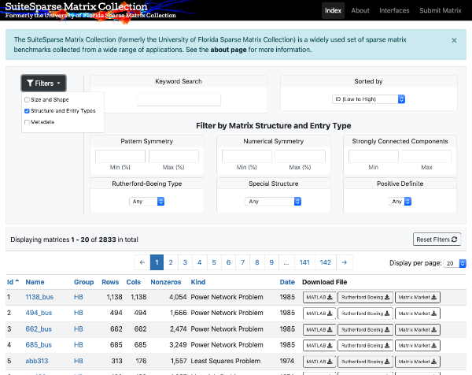
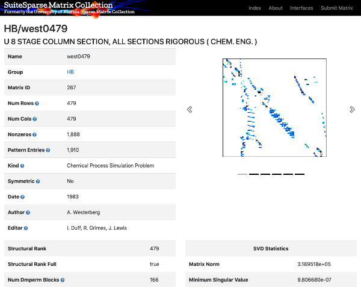

# Summary

The SuiteSparse Matrix Collection (formerly known as the University of Florida Sparse Matrix Collection) [@SSCollection] has grown significantly since its introduction, with newly added matrices representing almost seven times as much data than the entirety of the original Collection. With this growth, searching the Collection for matrices with specific names, structures, and other properties has become increasingly difficult. To make the Collection more accessible to the scientific computing community, we have developed a web application that allows real-time search and filtering of the Collection matrices.

Built on Ruby on Rails, the web application was developed with software engineering best practices such as test-driven development, continuous integration via Semaphore CI, and static analysis and code coverage via Code Climate. Collectively, the web application and data storage now serve as the canonical source of the Collection from which other services, including the Clarivate Data Citation Index [-@ClarivateDCI] and re3data [-@re3dataSuiteSparse] reference or mirror the Collection. A variety of interfaces for accessing the Collection, including `ssget` in MATLAB, also obtain their data from this application.

The SuiteSparse Matrix Collection has become the *lingua franca* of sparse matrix data and benchmarking, but its original website was written in static HTML, prohibiting any real-time searching or filtering of the Collection. With the current size, breadth, and variety of users of the Collection, this new web application provides to the scientific computing community a level of accessibility to the Collection not available before.

Examples of recent work that have utilized the Collection and its website to accomplish their scientific research goals include the following:

 - Computing optimal solutions to the bipartitioning problem for 839 sparse matrices [@knigge2018improved].
 - The development of a novel hybrid graph partitioning library, especially effective at partitioning social networks [@davisalgorithm].
 - A metric-constrained optimization method for computing lower bounds to the sparsest cut problem on undirected graphs [@veldt2018projection].

Note that these projects required identifying matrices with specific properties, which is enabled by the Collection web application.

# Features and Functionality

The SuiteSparse Matrix Collection web application provides a variety of features to help the scientific computing community access the Collection more easily.

## Matrix Property Search, Sorting, and Filtering

The SuiteSparse Matrix Collection web application allows real-time filtering by the following matrix properties:

### Matrix Size and Shape
  - **Rows** - The number of rows in the matrix.
  - **Columns** - The number of columns in the matrix.
  - **Nonzeros** - The number of nonzero entries in the matrix.

### Matrix Structure and Entry Type
  - **Pattern symmetry** - The percent of entries that are mirrored across the matrix diagonal. The numeric value of the entries is irrelevant.
  - **Numerical symmetry** - The percent of entries that are mirrored across the matrix diagonal with the identical numeric value.
  - **Number of strongly connected components** - The number of strongly connected components present in the resulting graph of this sparse matrix.
  - **Rutherford-Boeing type** - The type of entry in the sparse matrix. One of either Real, Complex, Integer, or Binary.
  - **Structure** - Special matrix structure, including square, rectangular, symmetric, skew-symmetric, Hermitian, and unsymmetric.
  - **Positive definiteness**

### Matrix Metadata
  - **Matrix name** - The specific name of the matrix.
  - **Matrix group** - The group name the matrix belongs to.
  - **Matrix ID** - The numeric identification number of the matrix (between 1 and 2833 as of this writing).
  - **Matrix Year** - The year the matrix was added to the Collection.

Additionally, matrix details are displayed on each matrix's individual page, including the matrix's rank, condition number, and information regarding its singular value decomposition. A variety of visualizations are also presented, including sparsity patterns, force-directed graph (or bipartite graph) visualizations [@hu2005efficient], Dulmage-Mendelsohn permuted sparsity patterns, and singular values plotted in decreasing size.

Matrices can also be quickly accessed by URL route matching. For example, the information page for the matrix HB/west0479 can be accessed directly by visiting [sparse.tamu.edu/HB/west0479](https://sparse.tamu.edu/HB/west0479). Information on the Mycielski group of matrices can be accessed by visiting [sparse.tamu.edu/Mycielski](https://sparse.tamu.edu/Mycielski).

## Matrix Data Download

Matrix data can be downloaded in MATLAB (.mat), Matrix Market [@MatrixMarket], and Rutherford-Boeing [@RutherfordBoeing] formats. Singular values are provided in MATLAB format.

## New Matrix Submission

Additionally, new matrices can be submitted to the collection via the web application. Information regarding the author, the field or domain from which the matrix comes from, and data about the matrix itself is collected via a form and converted to an email sent to the Collection curator.

# Deployment

The web application is deployed at [https://sparse.tamu.edu](https://sparse.tamu.edu), but can be viewed, downloaded, and contributed to on [GitHub](https://github.com/ScottKolo/suitesparse-matrix-collection-website).

# Acknowledgements

We would like to thank Dr. Jeff Huang for allowing us to develop this as part of his software engineering course, and David Ramirez for his help in deploying it at [sparse.tamu.edu](https://sparse.tamu.edu).

# References
